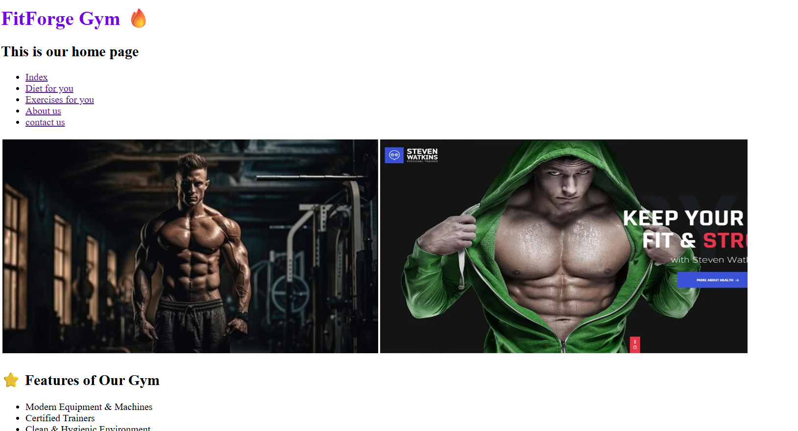

# 🏋️ Gym Website

## 🔗 Live Demo

[View Gym Website 🚀](https://gursewak-codes.github.io/Gym-website/)

## 🖼️ Preview

---

## 🚀 Features

* Multi-page website (Home, About, Exercises, Diet, Contact)
* Clean and modern UI design
* Responsive layout for different screen sizes
* Structured content for gym services
* Easy navigation between pages
* Beginner-friendly HTML project

---

## 💪 Sections Included

* 🏠 Home Page
* 📖 About Us
* 🏋️ Exercises
* 🥗 Diet Plans
* 📞 Contact Us

---

## 🛠️ Tech Used

* HTML
* Basic CSS

---

## 🎯 Purpose

This project is created to practice **frontend development skills** by building a complete multi-page gym website. It demonstrates how to structure webpages, link multiple pages, and design a simple user interface.

---

## 📌 Future Improvements

* Add advanced CSS styling & animations
* Make fully responsive with Flexbox/Grid
* Add JavaScript for interactivity
* Include real contact form functionality
